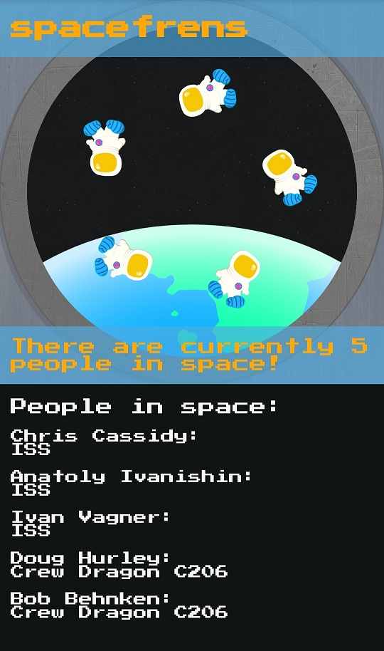

# SpaceFrens 👩‍🚀

SpaceFrens is a web app that displays the number of people currently in space using a simple animated graphic.
It pulls this information from the [open-notify.org API](http://open-notify.org/).

[Try it here!](https://spacefrens.herokuapp.com)

## Getting Started

To tinker with the SpaceFrens web app you'll need a suitable dev environment. I use [Visual Studio Code](https://code.visualstudio.com/) and the [Git Bash](https://gitforwindows.org/) UNIX terminal.

## Installation

1. To download the SpaceFrens repository open a UNIX terminal and enter the following command:

	`git clone git@github.com:devarrowsmith/spacefrens.git`

2. Run `NPM Install` to install the required dependencies.

3. The app can be hosted locally for development purposes. Run `NPM Start` in a terminal to serve the app, then open a web browser and go to http://localhost:8000 to view the app in its current state. [Nodemon](https://www.npmjs.com/package/nodemon) will automatically restart the app when changes are made within the spacefrens directory. This allows the user to make changes to the app in the dev environment, then view these changes in the browser simply by refreshing it.

## Built With

* [Express](https://www.npmjs.com/package/express)
* [CORS](https://www.npmjs.com/package/cors)
* [Node-fetch](https://www.npmjs.com/package/node-fetch)

## Acknowledgements

Data for the app is nabbed from the [open-notify.org](http://open-notify.org/) API.
